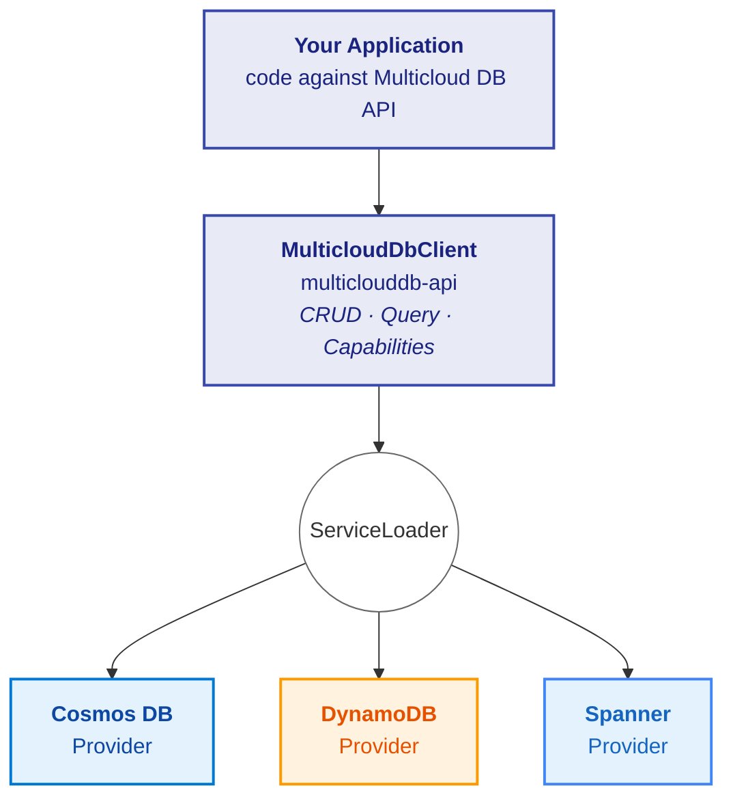

---
hide:
  - navigation
  - toc
---

<div class="hero-banner" markdown>


# Multicloud DB SDK for Java

A **portable database SDK** that lets you write CRUD and query logic once and run it
against **Azure Cosmos DB**, **Amazon DynamoDB**, or **Google Cloud Spanner** —
switch providers by changing a single properties file, with zero code changes.

<div class="hero-buttons" markdown>

[Get Started](getting-started.md){ .md-button .md-button--primary }
[Developer Guide](guide.md){ .md-button }
[View on GitHub](https://github.com/microsoft/multiclouddb-sdk-for-java){ .md-button }

</div>

</div>

!!! warning "Public Preview"

    This SDK is currently available as a **public preview** and is not yet fully
    ready for production use. Expect breaking changes, incomplete features, and
    limited support during this phase.

---

## Why Multicloud DB?

| Challenge | How the SDK helps |
|-----------|-------------------|
| **Vendor lock-in** | Single `MulticloudDbClient` interface — portable CRUD + query |
| **Divergent query languages** | Portable DSL auto-translated to Cosmos SQL, PartiQL, or GoogleSQL |
| **Migration pain** | Switch providers by changing one property — zero code changes |
| **Feature uncertainty** | Runtime `CapabilitySet` introspection with portability warnings |
| **Cross-provider testing** | Conformance suite runs identical tests against every provider |

---

## Key Features

<div class="feature-grid" markdown>

<div class="card" markdown>

### :material-swap-horizontal: Write Once, Run Anywhere

Single `MulticloudDbClient` interface for CRUD and query operations.
Switch providers by changing one config property — zero code changes.

[Learn more →](architecture.md)

</div>

<div class="card" markdown>

### :material-translate: Portable Query DSL

Write WHERE-clause filters once using a SQL-subset syntax with named parameters.
Automatically translated to Cosmos SQL, DynamoDB PartiQL, or Spanner GoogleSQL.

[Learn more →](compatibility.md#query--portable-expression-dsl)

</div>

<div class="card" markdown>

### :material-shield-check: Capability Introspection

Query provider capabilities at runtime. Get clear signals when a feature
is unavailable or behaviour may differ across providers.

[Learn more →](compatibility.md)

</div>

<div class="card" markdown>

### :material-office-building: Multi-Tenant Patterns

Database-per-tenant isolation via `ResourceAddress` routing.
Partition-scoped queries for efficient within-partition reads.

[Learn more →](samples/risk-platform.md)

</div>

<div class="card" markdown>

### :material-test-tube: Conformance Testing

281+ tests across API and provider modules. Identical CRUD + query tests
run against every provider emulator.

[Learn more →](contributing.md)

</div>

<div class="card" markdown>

### :material-speedometer: Provider Diagnostics

Structured diagnostics with latency, request charge (RU), and provider
correlation IDs. SLF4J structured logging for production monitoring.

[Learn more →](api-reference.md)

</div>

</div>

---

## Architecture



Providers are discovered at runtime via Java's `ServiceLoader` — no provider
imports in application code. Drop the provider JAR on the classpath and
configure via properties.

[Learn more about the architecture :material-arrow-right:](architecture.md){ .md-button }

---

## Supported Providers

| Provider | Module | Status | Native SDK |
|----------|--------|--------|------------|
| **Azure Cosmos DB** | `multiclouddb-provider-cosmos` | Full | Azure Cosmos Java SDK 4.60.0 |
| **Amazon DynamoDB** | `multiclouddb-provider-dynamo` | Full | AWS SDK for Java 2.25.16 |
| **Google Cloud Spanner** | `multiclouddb-provider-spanner` | Source only* | Google Cloud Spanner 6.62.0 |

> \* The Spanner provider source code and conformance tests are included in the repository,
> but **Maven artifacts are not yet published**. Spanner artifacts will be available in a future release.

---

## Sample Applications

| Sample | Description | Details |
|--------|-------------|---------|
| **TODO App** | Simple CRUD web app with browser UI | [View guide →](samples/todo-app.md) |
| **Risk Analysis Platform** | Multi-tenant portfolio risk analytics with executive dashboard | [View guide →](samples/risk-platform.md) |

---

## Quick Example

```java
// Configure — provider selected entirely by config
Properties props = new Properties();
props.load(getClass().getResourceAsStream("/app.properties"));

MulticloudDbClientConfig config = MulticloudDbClientConfig.builder()
    .provider(ProviderId.fromId(props.getProperty("multiclouddb.provider")))
    .connection("endpoint", props.getProperty("multiclouddb.connection.endpoint"))
    // Auth properties (key, credentials, etc.) are loaded from the
    // properties file. See Configuration Reference for recommended
    // identity-based auth patterns for each provider.
    .build();

MulticloudDbClient client = MulticloudDbClientFactory.create(config);

// CRUD — same code for every provider
ResourceAddress todos = new ResourceAddress("mydb", "todos");
Key key = Key.of("todo-1", "todo-1");
client.upsert(todos, key, doc);

// Query with portable expressions — auto-translated per provider
QueryRequest query = QueryRequest.builder()
    .expression("status = @status AND category = @cat")
    .parameters(Map.of("status", "active", "cat", "shopping"))
    .pageSize(25)
    .build();
QueryPage page = client.query(todos, query);
```

[Get started →](getting-started.md){ .md-button .md-button--primary }
