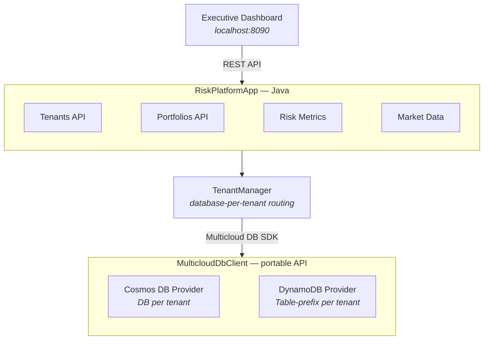

# Risk Analysis Platform

A professional-grade sample application built on the Multicloud DB SDK, demonstrating
**database-per-tenant isolation** across Azure Cosmos DB and Amazon DynamoDB.
Inspired by enterprise risk platforms serving capital markets, investment banks,
and hedge funds.

The app starts an embedded HTTP server on `http://localhost:8090` with a
dark-themed executive dashboard for portfolio risk analytics.

!!! tip "Samples repository"

    The Risk Analysis Platform source code and full setup instructions are in the
    **[multiclouddb-sdk-for-java-samples](https://github.com/microsoft/multiclouddb-sdk-for-java-samples)**
    repository. See the
    [Risk Platform README](https://github.com/microsoft/multiclouddb-sdk-for-java-samples/blob/main/README-risk-platform.md)
    for complete emulator setup, cloud provider configuration, build, and run instructions.

---

## Features

| Feature | Description |
|---------|-------------|
| **Multi-Tenant Isolation** | Database-per-tenant model — each tenant's data in a separate Cosmos DB database or DynamoDB table namespace |
| **Portfolio Management** | Multiple portfolios per tenant with real-time position tracking |
| **Risk Analytics** | VaR (95%/99%), Sharpe ratio, Beta, max drawdown, volatility, Treynor ratio |
| **Market Data Feed** | Real-time pricing for equities, bonds, commodities, and ETFs |
| **Risk Alerting** | Alert engine with severity levels (CRITICAL, HIGH, MEDIUM, LOW) |
| **Executive Dashboard** | Professional dark-themed financial UI with charts and data tables |
| **Provider Portability** | Zero code changes to switch between Cosmos DB and DynamoDB |
| **Partition-Scoped Queries** | Uses `QueryRequest.partitionKey()` to scope queries efficiently |
| **Auto-Provisioning** | Databases, containers, and tables created automatically on startup |

---

## Architecture



### Tenant Isolation Model

| Provider | Strategy | Example |
|----------|----------|---------|
| **Cosmos DB** | Separate database per tenant | Database: `acme-capital-risk-db`, Container: `portfolios` |
| **DynamoDB** | Composite table name | Table: `acme-capital-risk-db__portfolios` |

---

## Quick Start

Clone the samples repository and build:

```bash
git clone https://github.com/microsoft/multiclouddb-sdk-for-java-samples.git
cd multiclouddb-sdk-for-java-samples
mvn clean install -DskipTests
```

Then run against your chosen provider:

=== "Cosmos DB Emulator"

    ```bash
    mvn exec:java \
      -Dexec.mainClass=com.multiclouddb.samples.riskplatform.RiskPlatformApp \
      -Drisk.config=risk-platform-cosmos.properties \
      -Djavax.net.ssl.trustStore=$PWD/.tools/cacerts-local \
      -Djavax.net.ssl.trustStorePassword=changeit
    ```

=== "DynamoDB Local"

    ```bash
    mvn exec:java \
      -Dexec.mainClass=com.multiclouddb.samples.riskplatform.RiskPlatformApp \
      -Drisk.config=risk-platform-dynamo.properties
    ```

=== "Cosmos DB (Azure Cloud)"

    ```bash
    mvn exec:java \
      -Dexec.mainClass=com.multiclouddb.samples.riskplatform.RiskPlatformApp \
      -Drisk.config=risk-platform-cosmos-cloud.properties
    ```

=== "DynamoDB (AWS Cloud)"

    ```bash
    mvn exec:java \
      -Dexec.mainClass=com.multiclouddb.samples.riskplatform.RiskPlatformApp \
      -Drisk.config=risk-platform-dynamo-cloud.properties
    ```

Then open **http://localhost:8090** in your browser.

For detailed emulator setup, cloud configuration, and prerequisites, see the
[full Risk Platform guide](https://github.com/microsoft/multiclouddb-sdk-for-java-samples/blob/main/README-risk-platform.md).

---

## Dashboard

The executive dashboard provides:

- **Tenant selector** — switch between demo tenants
- **Portfolio overview** — aggregated metrics per portfolio
- **Position details** — individual holdings with real-time pricing
- **Risk metrics** — VaR, Sharpe ratio, Beta, max drawdown, volatility
- **Alert feed** — risk alerts with severity levels and timestamps

---

## REST API

| Endpoint | Method | Description |
|----------|--------|-------------|
| `/api/tenants` | GET | List all tenants |
| `/api/tenants/{id}/portfolios` | GET | List portfolios for a tenant |
| `/api/tenants/{id}/portfolios/{pid}` | GET | Portfolio detail with positions |
| `/api/tenants/{id}/portfolios/{pid}/risk` | GET | Risk metrics for a portfolio |
| `/api/tenants/{id}/alerts` | GET | Active alerts for a tenant |
| `/api/market-data` | GET | Current market prices |

---

## Demo Tenants

The platform seeds three demo tenants on startup:

| Tenant | Description | Portfolios |
|--------|-------------|------------|
| **Acme Capital** | Large diversified investment firm | Global Equity, Fixed Income, Commodities |
| **Vanguard Partners** | Technology-focused fund | Tech Growth, Balanced |
| **Summit Investments** | Conservative wealth manager | Conservative Income, Real Assets |

Each tenant demonstrates the database-per-tenant isolation pattern with
realistic portfolio data and risk metrics.

---

## Key SDK Features Demonstrated

### Database-per-Tenant via `ResourceAddress`

```java
public ResourceAddress addressFor(String tenantId, String collection) {
    String database = tenantId + "-risk-db";
    return new ResourceAddress(database, collection);
}
```

### Partition-Scoped Queries

```java
// Efficiently query positions within a single portfolio
QueryRequest query = QueryRequest.builder()
    .expression("sector = @sector")
    .parameter("sector", "Technology")
    .partitionKey("portfolio-alpha")
    .maxPageSize(50)
    .build();
```

### Auto-Provisioning

```java
Map<String, List<String>> schema = Map.of(
    "acme-risk-db", List.of("portfolios", "positions", "risk_metrics", "alerts")
);
client.provisionSchema(schema);
```

For complete setup instructions including emulator installation and cloud
provider configuration, see the
[full Risk Platform guide](https://github.com/microsoft/multiclouddb-sdk-for-java-samples/blob/main/README-risk-platform.md)
in the samples repository.
