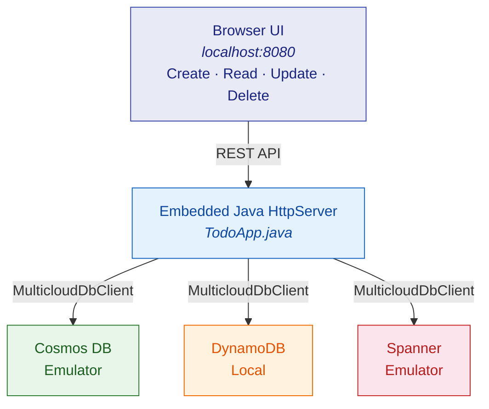

# TODO App Sample

A simple CRUD web application demonstrating the Multicloud DB SDK's portable API.
The same Java code runs against **Azure Cosmos DB**, **Amazon DynamoDB**, or
**Google Cloud Spanner** — switch providers by changing a single properties file.

The app starts an embedded HTTP server on `http://localhost:8080` with a
browser-based UI for managing TODO items.

---

## Architecture



---

## Prerequisites

| Tool | Version | Notes |
|------|---------|-------|
| JDK  | 17 LTS  | e.g., [Eclipse Adoptium](https://adoptium.net/) |
| Maven | 3.9+   | Build tool |
| Docker | 20+   | Required for Spanner Emulator (coming soon) |

---

## Emulator Setup

=== "Cosmos DB Emulator"

    Download and install from the
    [official docs](https://learn.microsoft.com/en-us/azure/cosmos-db/emulator#install-the-emulator).

    On Windows, launch from the Start Menu. It starts on `https://localhost:8081`.

    **Connection details** (already in `todo-app-cosmos.properties`):

    | Property | Value |
    |----------|-------|
    | Endpoint | `https://localhost:8081` |
    | Key | `C2y6yDjf5/R+ob0N8A7Cgv30VRDJIWEHLM+4QDU5DE2nQ9nDuVTqobD4b8mGGyPMbIZnqyMsEcaGQy67XIw/Jw==` |
    | Connection mode | `gateway` |

    !!! tip "SSL certificate"

        The emulator uses a self-signed TLS certificate. If you see SSL errors,
        import the certificate into a local truststore:

        ```bash
        keytool -importcert -alias cosmosemulator -file cosmos-emulator.cer \
                -keystore .tools/cacerts-local -storepass changeit -noprompt
        ```

=== "DynamoDB Local"

    Download and extract DynamoDB Local:

    ```bash
    mkdir -p .tools/dynamodb-local
    curl -L https://d1ni2b6xgvw0s0.cloudfront.net/v2.x/dynamodb_local_latest.zip \
      -o .tools/dynamodb-local/dynamodb_local.zip
    cd .tools/dynamodb-local && unzip dynamodb_local.zip && rm dynamodb_local.zip
    ```

    Start it:

    ```bash
    java -Djava.library.path=./DynamoDBLocal_lib -jar DynamoDBLocal.jar -sharedDb -port 8000
    ```

    Runs on `http://localhost:8000`.

=== "Spanner Emulator"

    ```bash
    docker run -p 9010:9010 -p 9020:9020 \
      gcr.io/cloud-spanner-emulator/emulator
    ```

---

## Running the Sample

=== "Cosmos DB"

    ```bash
    mvn -pl multiclouddb-samples exec:java \
      -Dexec.mainClass=com.multiclouddb.samples.todo.TodoApp \
      -Dtodo.config=todo-app-cosmos.properties \
      -Djavax.net.ssl.trustStore=$PWD/.tools/cacerts-local \
      -Djavax.net.ssl.trustStorePassword=changeit
    ```

=== "DynamoDB"

    ```bash
    mvn -pl multiclouddb-samples exec:java \
      -Dexec.mainClass=com.multiclouddb.samples.todo.TodoApp \
      -Dtodo.config=todo-app-dynamo.properties
    ```

=== "Spanner"

    ```bash
    mvn -pl multiclouddb-samples exec:java \
      -Dexec.mainClass=com.multiclouddb.samples.todo.TodoApp \
      -Dtodo.config=todo-app-spanner.properties
    ```

Then open **http://localhost:8080** in your browser.

---

## Web UI Features

The browser UI provides:

- **Create** — add new TODO items with a title
- **Read** — view all TODO items in a list
- **Update** — toggle completion status
- **Delete** — remove items

All operations use the portable `MulticloudDbClient` API under the hood. The
same UI and REST endpoints work identically regardless of which provider is
configured.
