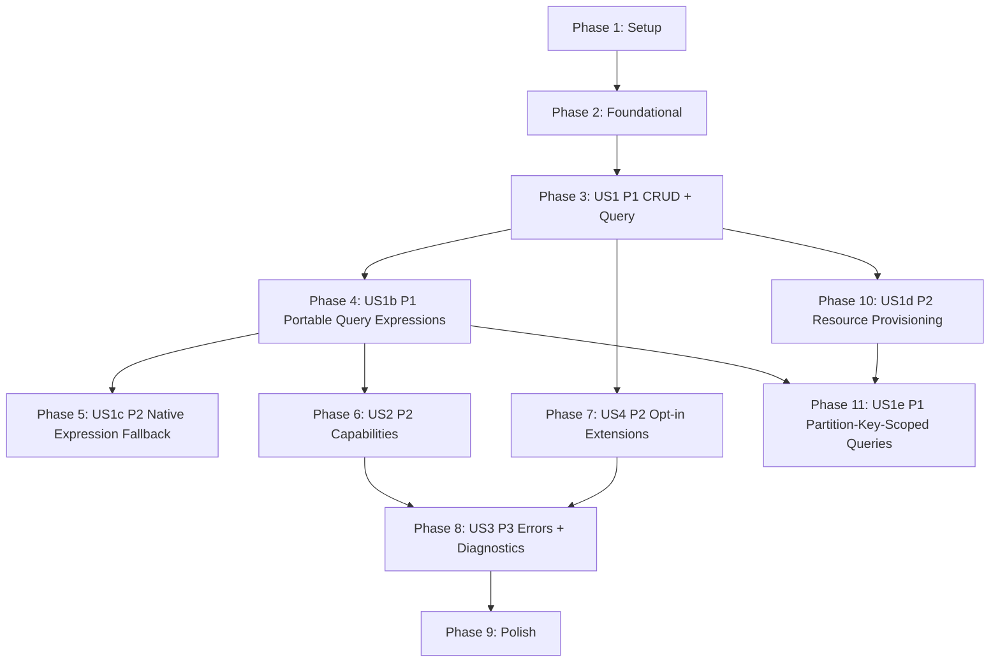

# Tasks: Hyperscale DB SDK (Unifying Database Client)

**Input**: Design documents from `specs/001-clouddb-sdk/`  
**Prerequisites**: plan.md (required), spec.md (required), research.md, data-model.md, contracts/openapi.yaml, quickstart.md

**Tech stack (from plan.md)**: Java 17 (LTS), multi-module Maven, SLF4J API, Jackson `JsonNode`, JUnit 5 + Mockito

## Format: `- [ ] T### [P?] [US?] Description with file path`

- **[P]**: Can run in parallel (different files, no dependencies)
- **[US#]**: User story label (required for story phases only)

---

## Phase 1: Setup (Shared Infrastructure)

**Purpose**: Create the multi-module Maven library skeleton and baseline build configuration.

- [x] T001 Create parent Maven aggregator `pom.xml` (modules + shared properties for Java 17)
- [x] T002 Create `hyperscaledb-api/pom.xml` (API module; depends on Jackson + SLF4J)
- [x] T003 Create `hyperscaledb-spi/pom.xml` (SPI module; depends on `hyperscaledb-api`)
- [x] T004 [P] Create `hyperscaledb-provider-cosmos/pom.xml` (provider module; depends on `hyperscaledb-spi` + `com.azure:azure-cosmos`)
- [x] T005 [P] Create `hyperscaledb-provider-dynamo/pom.xml` (provider module; depends on `hyperscaledb-spi` + `software.amazon.awssdk:dynamodb`)
- [x] T006 [P] Create `hyperscaledb-provider-spanner/pom.xml` (provider module; depends on `hyperscaledb-spi` + `com.google.cloud:google-cloud-spanner`)
- [x] T007 Create `hyperscaledb-conformance/pom.xml` (JUnit 5 conformance tests module; depends on `hyperscaledb-api` + all provider modules as test/runtime)
- [x] T008 Create `hyperscaledb-samples/pom.xml` (sample app; depends on `hyperscaledb-api` + chosen provider modules)
- [x] T009 Configure parent build plugins in `pom.xml` (maven-compiler-plugin Java 17, maven-enforcer-plugin, maven-surefire-plugin JUnit 5)
- [x] T010 [P] Add ServiceLoader resource directories to provider modules (`hyperscaledb-provider-*/src/main/resources/META-INF/services/`)

**Checkpoint**: `mvn -q test` runs (even if no tests yet) and the build enforces Java 17.

---

## Phase 2: Foundational (Blocking Prerequisites)

**Purpose**: Define the portable contract, shared types, SPI, configuration model, and the conformance harness scaffolding.

**⚠️ CRITICAL**: No provider adapter work should start until these types are in place.

- [x] T011 Create provider identifier enum in `hyperscaledb-api/src/main/java/com/hyperscaledb/api/ProviderId.java`
- [x] T012 [P] Create resource addressing type in `hyperscaledb-api/src/main/java/com/hyperscaledb/api/ResourceAddress.java`
- [x] T013 [P] Create portable key model in `hyperscaledb-api/src/main/java/com/hyperscaledb/api/Key.java`
- [x] T014 [P] Create portability warning type in `hyperscaledb-api/src/main/java/com/hyperscaledb/api/PortabilityWarning.java`
- [x] T015 [P] Create operation options type in `hyperscaledb-api/src/main/java/com/hyperscaledb/api/OperationOptions.java` (timeout + cancellation token placeholder)
- [x] T016 [P] Create query request and response types in `hyperscaledb-api/src/main/java/com/hyperscaledb/api/QueryRequest.java` and `hyperscaledb-api/src/main/java/com/hyperscaledb/api/QueryPage.java`
- [x] T017 Create error categories in `hyperscaledb-api/src/main/java/com/hyperscaledb/api/HyperscaleDbErrorCategory.java`
- [x] T018 Create error model in `hyperscaledb-api/src/main/java/com/hyperscaledb/api/HyperscaleDbError.java` (includes provider details in sanitized form)
- [x] T019 Create exception wrapper in `hyperscaledb-api/src/main/java/com/hyperscaledb/api/HyperscaleDbException.java` (carries `HyperscaleDbError`)
- [x] T020 Create client configuration model in `hyperscaledb-api/src/main/java/com/hyperscaledb/api/HyperscaleDbClientConfig.java` (provider + connection/auth maps + portable options + explicit feature flags)
- [x] T021 Create portable client interface in `hyperscaledb-api/src/main/java/com/hyperscaledb/api/HyperscaleDbClient.java` (create/read/update/upsert/delete/query + escape hatch placeholder)
- [x] T022 Create default client implementation shell in `hyperscaledb-api/src/main/java/com/hyperscaledb/api/internal/DefaultHyperscaleDbClient.java` (delegates to SPI adapter; throws structured errors until adapters exist)
- [x] T023 Create factory that selects adapter via ServiceLoader in `hyperscaledb-api/src/main/java/com/hyperscaledb/api/HyperscaleDbClientFactory.java`
- [x] T024 Define SPI adapter contract in `hyperscaledb-spi/src/main/java/com/hyperscaledb/spi/HyperscaleDbProviderAdapter.java` (provider id + createClient)
- [x] T025 Define SPI client contract in `hyperscaledb-spi/src/main/java/com/hyperscaledb/spi/HyperscaleDbProviderClient.java` (create/read/update/upsert/delete/query + native client access)
- [x] T026 Create conformance test config loader in `hyperscaledb-conformance/src/test/java/com/hyperscaledb/conformance/ConformanceConfig.java` (reads env vars / system props; validates required fields)
- [x] T027 Create conformance harness utilities in `hyperscaledb-conformance/src/test/java/com/hyperscaledb/conformance/ConformanceHarness.java` (build client from config; create unique test resource names)

**Checkpoint**: `hyperscaledb-api`, `hyperscaledb-spi`, and `hyperscaledb-conformance` compile; conformance tests can instantiate a client (even if operations are not yet implemented).

---

## Phase 3: User Story 1 - Write Once, Run Anywhere CRUD + Query (Priority: P1) 🎯 MVP

**Goal**: A single Java API can do portable create/read/update/upsert/delete/query against Cosmos/Dynamo/Spanner, selected by config only.

**Independent Test**: A single sample class runs CRUD + query against any provider by changing configuration only; conformance suite verifies the portable contract.

### Tests for User Story 1 (Requested by spec: FR-017 conformance suite)

- [x] T028 [P] [US1] Add CRUD conformance tests in `hyperscaledb-conformance/src/test/java/com/hyperscaledb/conformance/us1/CrudConformanceTest.java`
- [x] T029 [P] [US1] Add query paging conformance tests in `hyperscaledb-conformance/src/test/java/com/hyperscaledb/conformance/us1/QueryPagingConformanceTest.java`
- [x] T030 [P] [US1] Add key validation conformance tests in `hyperscaledb-conformance/src/test/java/com/hyperscaledb/conformance/us1/KeyValidationConformanceTest.java`

### Implementation for User Story 1

- [x] T031 [P] [US1] Implement Cosmos adapter registration in `hyperscaledb-provider-cosmos/src/main/resources/META-INF/services/com.hyperscaledb.spi.HyperscaleDbProviderAdapter`
- [x] T032 [P] [US1] Implement Dynamo adapter registration in `hyperscaledb-provider-dynamo/src/main/resources/META-INF/services/com.hyperscaledb.spi.HyperscaleDbProviderAdapter`
- [x] T033 [P] [US1] Implement Spanner adapter registration in `hyperscaledb-provider-spanner/src/main/resources/META-INF/services/com.hyperscaledb.spi.HyperscaleDbProviderAdapter`

- [x] T034 [US1] Implement Cosmos adapter entrypoint in `hyperscaledb-provider-cosmos/src/main/java/com/hyperscaledb/provider/cosmos/CosmosProviderAdapter.java` (creates `HyperscaleDbProviderClient`)
- [x] T035 [US1] Implement Cosmos client operations in `hyperscaledb-provider-cosmos/src/main/java/com/hyperscaledb/provider/cosmos/CosmosProviderClient.java` (create/read/update/upsert/delete/query + continuation token paging)

- [x] T036 [US1] Implement Dynamo adapter entrypoint in `hyperscaledb-provider-dynamo/src/main/java/com/hyperscaledb/provider/dynamo/DynamoProviderAdapter.java` (creates `HyperscaleDbProviderClient`)
- [x] T037 [P] [US1] Implement Dynamo JSON↔AttributeValue mapping in `hyperscaledb-provider-dynamo/src/main/java/com/hyperscaledb/provider/dynamo/DynamoItemMapper.java`
- [x] T038 [US1] Implement Dynamo client operations in `hyperscaledb-provider-dynamo/src/main/java/com/hyperscaledb/provider/dynamo/DynamoProviderClient.java` (create/read/update/upsert/delete + scan/query with paging token serialization)

- [x] T039 [US1] Implement Spanner adapter entrypoint in `hyperscaledb-provider-spanner/src/main/java/com/hyperscaledb/provider/spanner/SpannerProviderAdapter.java` (creates `HyperscaleDbProviderClient`)
- [x] T040 [P] [US1] Implement Spanner JSON row mapping in `hyperscaledb-provider-spanner/src/main/java/com/hyperscaledb/provider/spanner/SpannerRowMapper.java`
- [x] T041 [US1] Implement Spanner client operations in `hyperscaledb-provider-spanner/src/main/java/com/hyperscaledb/provider/spanner/SpannerProviderClient.java` (create/read/update/upsert/delete + query with best-effort paging)

- [x] T042 [US1] Wire adapter selection + delegation in `hyperscaledb-api/src/main/java/com/hyperscaledb/api/internal/DefaultHyperscaleDbClient.java` (invoke provider client; propagate warnings)

- [x] T043 [P] [US1] Create sample config loader in `hyperscaledb-samples/src/main/java/com/hyperscaledb/samples/ConfigLoader.java` (env var + system property support)
- [x] T044 [US1] Implement portable CRUD + query sample in `hyperscaledb-samples/src/main/java/com/hyperscaledb/samples/PortableCrudQuerySample.java` (switch provider by config only)

**Checkpoint**: Running `PortableCrudQuerySample` succeeds against each provider (using local emulator or live config), and conformance tests pass for the supported subset.

---

## Phase 4: User Story 1b - Portable Query Expressions Across Providers (Priority: P1)

**Goal**: Write query filter expressions once using a portable SQL-subset syntax with named `@paramName` parameters and portable function names. The SDK automatically translates expressions into each provider's native query format (Cosmos SQL, DynamoDB PartiQL, Spanner GoogleSQL).

**Independent Test**: A single portable expression (e.g., `status = @status AND starts_with(name, @prefix)`) executed against each provider returns equivalent results. Switching providers requires no expression changes.

**Key Design Decisions**: SQL-subset WHERE clause syntax (Decision 10), DynamoDB PartiQL backend (Decision 11), 5 portable functions (Decision 12), parsed AST via hand-written recursive-descent parser (Decision 13), capability-gated query features fail fast at translation time (Decision 15).

### Tests for User Story 1b (FR-017 conformance + FR-028 validation)

- [x] T045 [P] [US1b] Add expression parser unit tests in `hyperscaledb-conformance/src/test/java/com/hyperscaledb/conformance/us1b/ExpressionParserTest.java` (literals, operators, precedence, parentheses, functions, IN, BETWEEN, parameters, malformed input, empty/null)
- [x] T046 [P] [US1b] Add per-provider expression translation unit tests in `hyperscaledb-conformance/src/test/java/com/hyperscaledb/conformance/us1b/ExpressionTranslationTest.java` (verify AST→Cosmos SQL, AST→DynamoDB PartiQL, AST→Spanner GoogleSQL for each operator, function, and edge case)
- [x] T047 [P] [US1b] Add cross-provider portable query conformance tests in `hyperscaledb-conformance/src/test/java/com/hyperscaledb/conformance/us1b/PortableQueryConformanceTest.java` (same expression, same data, same results on all providers; covers SC-006, SC-007, SC-010)

### Implementation — AST Types (hyperscaledb-api)

- [x] T048 [P] [US1b] Create supporting leaf types in `hyperscaledb-api/src/main/java/com/hyperscaledb/api/query/`: `FieldRef.java` (field name string, supports single-level dot notation), `Literal.java` (typed value: string, number, boolean, null), `Parameter.java` (`@paramName` reference resolved from parameters map)
- [x] T049 [P] [US1b] Create enums in `hyperscaledb-api/src/main/java/com/hyperscaledb/api/query/`: `ComparisonOp.java` (EQ, NE, LT, GT, LE, GE), `LogicalOp.java` (AND, OR), `PortableFunction.java` (STARTS_WITH, CONTAINS, FIELD_EXISTS, STRING_LENGTH, COLLECTION_SIZE)
- [x] T050 [US1b] Create Expression sealed interface and 6 expression record types in `hyperscaledb-api/src/main/java/com/hyperscaledb/api/query/`: `Expression.java` (sealed root), `ComparisonExpression.java` (field op value/param), `LogicalExpression.java` (left AND/OR right), `NotExpression.java` (NOT child), `FunctionCallExpression.java` (portable function with arguments), `InExpression.java` (field IN values), `BetweenExpression.java` (field BETWEEN low AND high)

### Implementation — Parser & Validator (hyperscaledb-api)

- [x] T051 [US1b] Implement hand-written recursive-descent ExpressionParser in `hyperscaledb-api/src/main/java/com/hyperscaledb/api/query/ExpressionParser.java` (tokenizer + parser; handles operator precedence NOT > AND > OR, parentheses, function calls, IN lists, BETWEEN, literal types, @param references; returns Expression AST; throws on malformed input per FR-028)
- [x] T052 [US1b] Implement ExpressionValidator in `hyperscaledb-api/src/main/java/com/hyperscaledb/api/query/ExpressionValidator.java` (validates all @param references have corresponding entries in parameters map, validates function names against provider capabilities, validates capability-gated features per FR-028/FR-032; produces typed validation errors with position info)

### Implementation — Translator SPI (hyperscaledb-api)

- [x] T053 [US1b] Create ExpressionTranslator SPI interface in `hyperscaledb-api/src/main/java/com/hyperscaledb/api/spi/ExpressionTranslator.java` (method: `translate(Expression, Map<String,Object> parameters, ResourceAddress)` → `TranslatedQuery`; method: `supportedCapabilities()` → `Set<Capability>`)
- [x] T054 [US1b] Create TranslatedQuery result type in `hyperscaledb-api/src/main/java/com/hyperscaledb/api/query/TranslatedQuery.java` (fields: nativeExpression string, boundParameters map/list, optional fullStatement string)

### Implementation — API Modifications (hyperscaledb-api)

- [x] T055 [US1b] Add `nativeExpression` field to `hyperscaledb-api/src/main/java/com/hyperscaledb/api/QueryRequest.java` (mutually exclusive with `expression`; builder validation: exactly one of expression/nativeExpression set, or both null for full scan per FR-029/FR-030; `nativeExpression` includes target provider id for validation)
- [x] T056 [US1b] Add 6 query capability constants to `hyperscaledb-api/src/main/java/com/hyperscaledb/api/Capability.java` (PORTABLE_QUERY_EXPRESSION, LIKE_OPERATOR, ORDER_BY, ENDS_WITH, REGEX_MATCH, CASE_FUNCTIONS)

### Implementation — Provider Translators

- [x] T057 [P] [US1b] Implement CosmosExpressionTranslator in `hyperscaledb-provider-cosmos/src/main/java/com/hyperscaledb/provider/cosmos/CosmosExpressionTranslator.java` (AST → Cosmos SQL WHERE clause; adds `c.` prefix to field refs; keeps `@paramName` parameters; translates functions: starts_with→STARTSWITH, contains→CONTAINS, field_exists→IS_DEFINED, string_length→LENGTH, collection_size→ARRAY_LENGTH; generates full statement `SELECT * FROM c WHERE ...`)
- [x] T058 [P] [US1b] Implement DynamoExpressionTranslator in `hyperscaledb-provider-dynamo/src/main/java/com/hyperscaledb/provider/dynamo/DynamoExpressionTranslator.java` (AST → DynamoDB PartiQL WHERE clause; double-quotes table name; converts `@paramName` to positional `?` parameters and builds ordered parameter list; translates functions: starts_with→begins_with, contains→contains, field_exists→IS NOT MISSING, string_length→char_length, collection_size→size; handles reserved word escaping with double-quotes)
- [x] T059 [P] [US1b] Implement SpannerExpressionTranslator in `hyperscaledb-provider-spanner/src/main/java/com/hyperscaledb/provider/spanner/SpannerExpressionTranslator.java` (AST → Spanner GoogleSQL WHERE clause; bare field names; keeps `@paramName` parameters; translates functions: starts_with→STARTS_WITH, contains→STRPOS(field,value)>0, field_exists→field IS NOT NULL, string_length→CHAR_LENGTH, collection_size→ARRAY_LENGTH; generates full statement `SELECT * FROM <table> WHERE ...`)

### Implementation — Provider Integration

- [x] T060 [US1b] Switch DynamoDB query backend from Scan + FilterExpression to PartiQL `executeStatement` in `hyperscaledb-provider-dynamo/src/main/java/com/hyperscaledb/provider/dynamo/DynamoProviderClient.java` (replace Scan-based query with `DynamoDbClient.executeStatement()`; handle PartiQL parameter binding with positional `?` params; implement continuation token via `nextToken`; preserve paging semantics per Decision 11)
- [x] T061 [US1b] Integrate expression parsing, validation, and translation in `hyperscaledb-api/src/main/java/com/hyperscaledb/api/internal/DefaultHyperscaleDbClient.java` (when `expression` is set: parse → validate → translate via provider's ExpressionTranslator → pass TranslatedQuery to provider client; when `nativeExpression` is set: pass through; when both null: full scan per FR-029; fail fast on validation errors before any I/O per FR-028)
- [x] T062 [P] [US1b] Update CosmosProviderClient to accept TranslatedQuery for portable expressions in `hyperscaledb-provider-cosmos/src/main/java/com/hyperscaledb/provider/cosmos/CosmosProviderClient.java` (use translated fullStatement as Cosmos SQL query; bind parameters from TranslatedQuery)
- [x] T063 [P] [US1b] Update SpannerProviderClient to accept TranslatedQuery for portable expressions in `hyperscaledb-provider-spanner/src/main/java/com/hyperscaledb/provider/spanner/SpannerProviderClient.java` (use translated fullStatement as Spanner GoogleSQL; bind named parameters from TranslatedQuery)
- [x] T064 [P] [US1b] Update CosmosCapabilities to include query DSL capabilities in `hyperscaledb-provider-cosmos/src/main/java/com/hyperscaledb/provider/cosmos/CosmosCapabilities.java` (add: PORTABLE_QUERY_EXPRESSION, LIKE_OPERATOR, ORDER_BY, ENDS_WITH, REGEX_MATCH, CASE_FUNCTIONS — all supported)
- [x] T065 [P] [US1b] Update DynamoCapabilities to include query DSL capabilities in `hyperscaledb-provider-dynamo/src/main/java/com/hyperscaledb/provider/dynamo/DynamoCapabilities.java` (add: PORTABLE_QUERY_EXPRESSION supported; LIKE_OPERATOR, ORDER_BY, ENDS_WITH, REGEX_MATCH, CASE_FUNCTIONS unsupported)
- [x] T066 [P] [US1b] Update SpannerCapabilities to include query DSL capabilities in `hyperscaledb-provider-spanner/src/main/java/com/hyperscaledb/provider/spanner/SpannerCapabilities.java` (add: PORTABLE_QUERY_EXPRESSION, LIKE_OPERATOR, ORDER_BY, ENDS_WITH, CASE_FUNCTIONS supported; REGEX_MATCH supported)

**Checkpoint**: A portable expression like `status = @status AND starts_with(name, @prefix)` executes correctly against each provider via the conformance tests. DynamoDB queries now use PartiQL. Capability-gated features (e.g., LIKE on DynamoDB) fail fast with typed errors before execution. SC-006, SC-007, SC-008, SC-010 verifiable.

---

## Phase 5: User Story 1c - Native Expression Fallback (Priority: P2)

**Goal**: Use provider-specific query features (e.g., `LIKE` on Cosmos, regex on Spanner) by submitting a native expression that bypasses the portable translator. The SDK passes the expression through directly and clearly signals non-portability.

**Independent Test**: A native Cosmos SQL expression with `LIKE` executes correctly on Cosmos. Attempting to run the same native expression against DynamoDB produces a clear error. SC-009 verifiable.

### Tests for User Story 1c

- [x] T067 [P] [US1c] Add native expression passthrough conformance tests in `hyperscaledb-conformance/src/test/java/com/hyperscaledb/conformance/us1c/NativeExpressionConformanceTest.java` (native Cosmos SQL with LIKE succeeds on Cosmos; native DynamoDB PartiQL succeeds on DynamoDB; native Spanner GoogleSQL succeeds on Spanner)
- [x] T068 [P] [US1c] Add cross-provider native expression mismatch tests in `hyperscaledb-conformance/src/test/java/com/hyperscaledb/conformance/us1c/NativeExpressionMismatchTest.java` (native Cosmos expression on DynamoDB → clear error; native DynamoDB expression on Cosmos → clear error; validates targetProvider mismatch detection per FR-030)

### Implementation for User Story 1c

- [x] T069 [US1c] Implement native expression validation and passthrough in `hyperscaledb-api/src/main/java/com/hyperscaledb/api/internal/DefaultHyperscaleDbClient.java` (when `nativeExpression` is set: validate targetProvider matches current provider → fail fast with structured error if mismatch; pass expression text directly to provider client without translation; emit portability warning per FR-027/FR-030)
- [x] T070 [P] [US1c] Implement Cosmos native expression passthrough in `hyperscaledb-provider-cosmos/src/main/java/com/hyperscaledb/provider/cosmos/CosmosProviderClient.java` (accept raw native expression string; execute as Cosmos SQL directly; bind parameters if provided)
- [x] T071 [P] [US1c] Implement DynamoDB native expression passthrough (PartiQL) in `hyperscaledb-provider-dynamo/src/main/java/com/hyperscaledb/provider/dynamo/DynamoProviderClient.java` (accept raw native expression string; execute as PartiQL directly via executeStatement; bind positional parameters)
- [x] T072 [P] [US1c] Implement Spanner native expression passthrough in `hyperscaledb-provider-spanner/src/main/java/com/hyperscaledb/provider/spanner/SpannerProviderClient.java` (accept raw native expression string; execute as Spanner GoogleSQL directly; bind named parameters)

**Checkpoint**: Native expressions pass through to each provider correctly. Cross-provider mismatch is detected and produces structured errors. Portable contract is unaffected when native mode is not used. SC-009 passes.

---

## Phase 6: User Story 2 - Portability Confidence via Capabilities & Clear Differences (Priority: P2)

**Goal**: Users can preflight capabilities and get fail-fast, actionable errors when a capability is not supported.

**Independent Test**: A test run can assert that unsupported capabilities are discoverable and cause structured fail-fast errors. This now includes the 6 query DSL capabilities added in Phase 4.

### Tests for User Story 2

- [x] T073 [P] [US2] Add capability discovery tests in `hyperscaledb-conformance/src/test/java/com/hyperscaledb/conformance/us2/CapabilitiesConformanceTest.java` (includes query DSL capabilities: verify Cosmos reports all 6 supported, DynamoDB reports only PORTABLE_QUERY_EXPRESSION, Spanner reports all except those unsupported)
- [x] T074 [P] [US2] Add fail-fast unsupported capability tests in `hyperscaledb-conformance/src/test/java/com/hyperscaledb/conformance/us2/UnsupportedCapabilityConformanceTest.java` (includes query capability-gated features: LIKE on DynamoDB → structured error per SC-008)

### Implementation for User Story 2

- [x] T075 [US2] Define capability names and model in `hyperscaledb-api/src/main/java/com/hyperscaledb/api/Capability.java` and `hyperscaledb-api/src/main/java/com/hyperscaledb/api/CapabilitySet.java` (general CRUD capabilities + query DSL capabilities from T056)
- [x] T076 [US2] Add `capabilities()` to `hyperscaledb-api/src/main/java/com/hyperscaledb/api/HyperscaleDbClient.java` and implement in `hyperscaledb-api/src/main/java/com/hyperscaledb/api/internal/DefaultHyperscaleDbClient.java`
- [x] T077 [P] [US2] Implement Cosmos capabilities in `hyperscaledb-provider-cosmos/src/main/java/com/hyperscaledb/provider/cosmos/CosmosCapabilities.java` (merge CRUD + query capabilities into single capability set)
- [x] T078 [P] [US2] Implement Dynamo capabilities in `hyperscaledb-provider-dynamo/src/main/java/com/hyperscaledb/provider/dynamo/DynamoCapabilities.java` (merge CRUD + query capabilities into single capability set)
- [x] T079 [P] [US2] Implement Spanner capabilities in `hyperscaledb-provider-spanner/src/main/java/com/hyperscaledb/provider/spanner/SpannerCapabilities.java` (merge CRUD + query capabilities into single capability set)
- [x] T080 [US2] Enforce fail-fast checks in `hyperscaledb-api/src/main/java/com/hyperscaledb/api/internal/DefaultHyperscaleDbClient.java` (when request depends on an unsupported capability, including query capability-gated features)

**Checkpoint**: Apps can call `client.capabilities()` and receive deterministic support info for all capabilities including query DSL features; unsupported operations return `HyperscaleDbException` with actionable messages.

---

## Phase 7: User Story 4 - Opt-in Provider Extensions with Visible Portability Impact (Priority: P2)

**Goal**: Provider-specific behavior is available only via explicit opt-in, and it emits portability warnings.

**Independent Test**: Enabling a provider feature flag produces a portability warning signal; portable contract remains unchanged when flags are absent.

### Tests for User Story 4

- [x] T081 [P] [US4] Add portability warning emission tests in `hyperscaledb-conformance/src/test/java/com/hyperscaledb/conformance/us4/PortabilityWarningConformanceTest.java`
- [x] T082 [P] [US4] Add escape hatch access tests in `hyperscaledb-conformance/src/test/java/com/hyperscaledb/conformance/us4/NativeClientAccessConformanceTest.java`

### Implementation for User Story 4

- [x] T083 [US4] Add escape hatch API to `hyperscaledb-api/src/main/java/com/hyperscaledb/api/HyperscaleDbClient.java` (e.g., `nativeClient(Class<T>)`)
- [x] T084 [US4] Implement escape hatch wiring in `hyperscaledb-api/src/main/java/com/hyperscaledb/api/internal/DefaultHyperscaleDbClient.java` (delegates to provider)
- [x] T085 [P] [US4] Implement Cosmos escape hatch + opt-ins in `hyperscaledb-provider-cosmos/src/main/java/com/hyperscaledb/provider/cosmos/CosmosExtensions.java` (feature flags → warning codes)
- [x] T086 [P] [US4] Implement Dynamo escape hatch + opt-ins in `hyperscaledb-provider-dynamo/src/main/java/com/hyperscaledb/provider/dynamo/DynamoExtensions.java` (feature flags → warning codes)
- [x] T087 [P] [US4] Implement Spanner escape hatch + opt-ins in `hyperscaledb-provider-spanner/src/main/java/com/hyperscaledb/provider/spanner/SpannerExtensions.java` (feature flags → warning codes)
- [x] T088 [US4] Ensure warning propagation to results in `hyperscaledb-api/src/main/java/com/hyperscaledb/api/internal/DefaultHyperscaleDbClient.java` (portable calls surface warnings when opt-ins are enabled)

**Checkpoint**: Opt-ins are configuration-driven, visible, and warnings are structured and provider-neutral.

---

## Phase 8: User Story 3 - Consistent Failure Handling & Diagnostics (Priority: P3)

**Goal**: Errors are categorized consistently across providers with retryability + sanitized details, and each operation exposes diagnostics.

**Independent Test**: Unit/conformance tests verify consistent categories and diagnostics presence without secret leakage.

### Tests for User Story 3

- [x] T089 [P] [US3] Add error mapping unit tests for Cosmos in `hyperscaledb-provider-cosmos/src/test/java/com/hyperscaledb/provider/cosmos/CosmosErrorMappingTest.java`
- [x] T090 [P] [US3] Add error mapping unit tests for Dynamo in `hyperscaledb-provider-dynamo/src/test/java/com/hyperscaledb/provider/dynamo/DynamoErrorMappingTest.java`
- [x] T091 [P] [US3] Add error mapping unit tests for Spanner in `hyperscaledb-provider-spanner/src/test/java/com/hyperscaledb/provider/spanner/SpannerErrorMappingTest.java`
- [x] T092 [P] [US3] Add diagnostics presence tests in `hyperscaledb-conformance/src/test/java/com/hyperscaledb/conformance/us3/DiagnosticsConformanceTest.java`

### Implementation for User Story 3

- [x] T093 [US3] Define diagnostics model in `hyperscaledb-api/src/main/java/com/hyperscaledb/api/OperationDiagnostics.java` (provider, operation, duration, request id)
- [x] T094 [US3] Attach diagnostics to results/errors in `hyperscaledb-api/src/main/java/com/hyperscaledb/api/HyperscaleDbException.java` and `hyperscaledb-api/src/main/java/com/hyperscaledb/api/internal/DefaultHyperscaleDbClient.java`
- [x] T095 [P] [US3] Implement Cosmos exception mapping + sanitization in `hyperscaledb-provider-cosmos/src/main/java/com/hyperscaledb/provider/cosmos/CosmosErrorMapper.java`
- [x] T096 [P] [US3] Implement Dynamo exception mapping + sanitization in `hyperscaledb-provider-dynamo/src/main/java/com/hyperscaledb/provider/dynamo/DynamoErrorMapper.java`
- [x] T097 [P] [US3] Implement Spanner exception mapping + sanitization in `hyperscaledb-provider-spanner/src/main/java/com/hyperscaledb/provider/spanner/SpannerErrorMapper.java`
- [x] T098 [US3] Use mappers in provider clients (`hyperscaledb-provider-cosmos/src/main/java/com/hyperscaledb/provider/cosmos/CosmosProviderClient.java`, `hyperscaledb-provider-dynamo/src/main/java/com/hyperscaledb/provider/dynamo/DynamoProviderClient.java`, `hyperscaledb-provider-spanner/src/main/java/com/hyperscaledb/provider/spanner/SpannerProviderClient.java`) to produce consistent `HyperscaleDbException` and retryable signals

**Checkpoint**: Errors are consistent across providers, include retryability, and diagnostics are available without logging secrets.

---

## Phase 9: Polish & Cross-Cutting Concerns

**Purpose**: Documentation, compatibility policy, sample updates, and baseline quality improvements that cut across stories.

- [x] T099 [P] Document provider compatibility & portability guarantees in `docs/compatibility.md` (fulfills FR-018; includes query DSL portability matrix and capability-gated features table)
- [x] T100 Update quickstart to match actual module/artifact usage in `specs/001-clouddb-sdk/quickstart.md` (verify portable expression examples work end-to-end)
- [x] T101 Add provider configuration examples for conformance + samples in `specs/001-clouddb-sdk/quickstart.md` (env vars/system props)
- [x] T102 Run and update conceptual contract notes (if needed) in `specs/001-clouddb-sdk/contracts/openapi.yaml`
- [x] T103 [P] Update sample app to demonstrate portable query expressions in `hyperscaledb-samples/src/main/java/com/hyperscaledb/samples/PortableCrudQuerySample.java` (add portable expression examples + native expression fallback example from quickstart.md)

---

## Phase 10: User Story 1d - Portable Resource Provisioning (Priority: P2)

**Goal**: Applications can create database and collection/container/table resources using the SDK's portable API (`ensureDatabase` + `ensureContainer`) without any provider-specific provisioning code.

**Independent Test**: The Risk Platform sample app provisions all its databases and collections via `client.ensureDatabase()` and `client.ensureContainer()` calls only, with zero provider-specific code in the provisioner. The same provisioning code works against Cosmos DB emulator and DynamoDB Local.

**Key Design Decisions**: Provisioning as default no-op SPI methods (backward-compatible), idempotent creation (catch "already exists"), standard schema per provider (partition key `/partitionKey` for Cosmos, hash+sort key for DynamoDB, `partitionKey`+`sortKey`+`data` columns for Spanner).

### Implementation — SPI & Public API

- [x] T104 [US1d] Add `ensureDatabase(String database)` and `ensureContainer(ResourceAddress address)` as default no-op methods to `hyperscaledb-api/src/main/java/com/hyperscaledb/api/spi/HyperscaleDbProviderClient.java` (default implementations log debug and return; providers override as needed)
- [x] T105 [US1d] Add `ensureDatabase(String database)` and `ensureContainer(ResourceAddress address)` to `hyperscaledb-api/src/main/java/com/hyperscaledb/api/HyperscaleDbClient.java` (public API surface)
- [x] T106 [US1d] Add provisioning delegation with diagnostics/timing to `hyperscaledb-api/src/main/java/com/hyperscaledb/api/internal/DefaultHyperscaleDbClient.java` (Instant timing, HyperscaleDbException enrichment, wrapUnexpected pattern consistent with existing operations)

### Implementation — Provider Provisioning

- [x] T107 [P] [US1d] Implement Cosmos provisioning in `hyperscaledb-provider-cosmos/src/main/java/com/hyperscaledb/provider/cosmos/CosmosProviderClient.java` (`ensureDatabase` → `cosmosClient.createDatabaseIfNotExists(database)`; `ensureContainer` → `database.createContainerIfNotExists(new CosmosContainerProperties(collection, "/partitionKey"))`)
- [x] T108 [P] [US1d] Implement DynamoDB provisioning in `hyperscaledb-provider-dynamo/src/main/java/com/hyperscaledb/provider/dynamo/DynamoProviderClient.java` (`ensureDatabase` → no-op with debug log; `ensureContainer` → resolves table name via `resolveTableName()`, checks `listTables()`, creates table with `ATTR_ID` hash key + `ATTR_SORT_KEY` sort key, `BillingMode.PAY_PER_REQUEST`, catches `ResourceInUseException` for race conditions)
- [x] T109 [P] [US1d] Implement Spanner provisioning in `hyperscaledb-provider-spanner/src/main/java/com/hyperscaledb/provider/spanner/SpannerProviderClient.java` (`ensureDatabase` → no-op; `ensureContainer` → probes with `SELECT 1 FROM tableName LIMIT 1`, catches NOT_FOUND/INVALID_ARGUMENT, then creates via `DatabaseAdminClient.updateDatabaseDdl()` with DDL: `CREATE TABLE tableName (partitionKey STRING(MAX) NOT NULL, sortKey STRING(MAX) NOT NULL, data STRING(MAX)) PRIMARY KEY (partitionKey, sortKey)`, catches "Duplicate name in schema" for race conditions)

### Integration — Sample App

- [x] T110 [US1d] Overhaul `ResourceProvisioner` in `hyperscaledb-samples/src/main/java/com/hyperscaledb/samples/risk/ResourceProvisioner.java` to use only `client.ensureDatabase()` + `client.ensureContainer()` — remove ALL provider-specific imports and SDK calls; provisioning is now fully provider-agnostic (156→82 lines)

**Checkpoint**: The Risk Platform sample provisions databases and collections on both Cosmos DB emulator and DynamoDB Local using only the portable provisioning API. No provider SDKs are imported in the provisioner. All 322+ tests pass.

---

## Phase 11: User Story 1e - Partition-Key-Scoped Queries (Priority: P1)

**Goal**: Queries can be scoped to a specific partition key value, enabling each provider to use its native efficient partition-scoping mechanism instead of cross-partition scans. The sample application demonstrates correct data modeling with partition key co-location.

**Independent Test**: A query with `partitionKey("portfolio-alpha")` returns only items within that partition on both Cosmos DB and DynamoDB, and each provider uses its native efficient mechanism.

**Key Design Decisions**: `QueryRequest.partitionKey` is optional (null = cross-partition, backward compatible). Cosmos DB uses `CosmosQueryRequestOptions.setPartitionKey()`. DynamoDB adds `partitionKey` WHERE condition in PartiQL. Sample app keys positions as `Key.of(portfolioId, positionId)` for co-location (partition key first).

### Implementation — API Modification

- [x] T111 [US1e] Add optional `partitionKey` field to `hyperscaledb-api/src/main/java/com/hyperscaledb/api/QueryRequest.java` (builder method `partitionKey(String value)`, getter `partitionKey()`, null by default for backward compatibility)

### Implementation — Provider Partition Scoping

- [x] T112 [P] [US1e] Update Cosmos query methods in `hyperscaledb-provider-cosmos/src/main/java/com/hyperscaledb/provider/cosmos/CosmosProviderClient.java` to set `CosmosQueryRequestOptions.setPartitionKey(new PartitionKey(pk))` when `QueryRequest.partitionKey()` is non-null (applies to both `query()` and `queryWithTranslation()` methods); also updated `create()`/`upsert()` to always set `partitionKey` document field (defaulting to `key.sortKey()` when partition is null) for correct container partition key path `/partitionKey`
- [x] T113 [P] [US1e] Update DynamoDB query methods in `hyperscaledb-provider-dynamo/src/main/java/com/hyperscaledb/provider/dynamo/DynamoProviderClient.java` to add `AND "partitionKey" = '?'` WHERE condition in PartiQL when `QueryRequest.partitionKey()` is non-null (applies to both `query()` and `queryWithTranslation()` methods)
- [x] T114 [P] [US1e] Update Spanner query methods in `hyperscaledb-provider-spanner/src/main/java/com/hyperscaledb/provider/spanner/SpannerProviderClient.java` to add `AND partitionKey = @_pkval` WHERE condition when `QueryRequest.partitionKey()` is non-null

### Implementation — Sample App Data Model Fix

- [x] T115 [US1e] Update `DemoDataSeeder` in `hyperscaledb-samples/src/main/java/com/hyperscaledb/samples/riskplatform/data/DemoDataSeeder.java` to use `Key.of(portfolioId, positionId)` for positions, `Key.of(portfolioId, metricsId)` for risk_metrics, and `Key.of(portfolioId, alertId)` for alerts (co-locate related documents by portfolio, partition key first)
- [x] T116 [US1e] Update `RiskPlatformApp` in `hyperscaledb-samples/src/main/java/com/hyperscaledb/samples/riskplatform/RiskPlatformApp.java` to use partition-key-scoped queries (replace `expression("portfolioId = @pid")` with `partitionKey(portfolioId)` or combine both; update `Key.of(posId, posId)` to `Key.of(portfolioId, posId)` for inline position creation, partition key first)
- [x] T117 [US1e] Update `TenantManager` in `hyperscaledb-samples/src/main/java/com/hyperscaledb/samples/riskplatform/tenant/TenantManager.java` to add a `queryByPartition(tenantId, collection, partitionKey, query)` helper method for partition-scoped queries

### Tests — Partition-Key-Scoped Queries

- [x] T118 [P] [US1e] Add partition-key-scoped query conformance tests in `hyperscaledb-conformance/src/test/java/com/hyperscaledb/conformance/CrudConformanceTests.java` — added 3 tests: `queryByPartitionKey` (Order 11), `queryWithoutPartitionKey` (Order 12), `queryNonexistentPartition` (Order 13) — verifies partition isolation, cross-partition backward compatibility, and empty-result handling
- [x] T119 [US1e] Build and validate all tests pass with partition-key-scoped query support — 281 tests pass (0 failures, 0 errors) across Cosmos DB and DynamoDB; Spanner deferred (emulator unavailable)

**Checkpoint**: Partition-key-scoped queries work on all providers. The Risk Platform sample demonstrates correct data modeling with position co-location by portfolioId. Cross-partition scans are eliminated for portfolio-scoped queries. SC-013, SC-014 pass.

---

## Dependencies & Execution Order

### Phase Dependencies

- **Setup (Phase 1)**: No dependencies; start immediately
- **Foundational (Phase 2)**: Depends on Setup; blocks all user stories
- **US1 — CRUD + Query (Phase 3)**: Depends on Foundational; MVP target
- **US1b — Portable Query Expressions (Phase 4)**: Depends on US1 (needs working adapters and query infrastructure)
- **US1c — Native Expression Fallback (Phase 5)**: Depends on US1b (needs nativeExpression field on QueryRequest from T055 and translator integration from T061)
- **US2 — Capabilities (Phase 6)**: Depends on US1b (needs query capability constants from T056 and per-provider capabilities from T064–T066)
- **US4 — Opt-in Extensions (Phase 7)**: Depends on US1 (needs working adapters); can proceed in parallel with US1b/US1c/US2
- **US3 — Errors & Diagnostics (Phase 8)**: Depends on US2 and US4
- **Polish (Phase 9)**: Depends on completing the desired user stories
- **US1d — Resource Provisioning (Phase 10)**: Depends on Foundational (Phase 2); needs HyperscaleDbClient, HyperscaleDbProviderClient, DefaultHyperscaleDbClient, and working provider adapters. Can proceed independently of US1b/US1c.
- **US1e — Partition-Key-Scoped Queries (Phase 11)**: Depends on US1b (needs QueryRequest + working query infrastructure). Sample app fixes depend on US1d (provisioning).

### Dependency Graph

### User Story Dependencies

- **US1 (P1)**: Depends on Phase 2 only
- **US1b (P1)**: Depends on US1 (working provider adapters + query infrastructure)
- **US1c (P2)**: Depends on US1b (nativeExpression field + translator integration)
- **US1d (P2)**: Depends on US1 (working provider adapters + HyperscaleDbClient/SPI interfaces); independent of US1b/US1c
- **US1e (P1)**: Depends on US1b (QueryRequest + query infrastructure) and US1d (provisioning for sample app)
- **US2 (P2)**: Depends on US1b (query capability constants and per-provider capability sets)
- **US4 (P2)**: Depends on US1 client/adapters; independent of US1b/US1c
- **US3 (P3)**: Depends on US2 and US4

---

## Parallel Opportunities

- **Phase 1**: Provider `pom.xml` files (T004–T006) are parallel
- **Phase 2**: Most portable type files are parallel (T012–T016)
- **US1**: Adapter registrations (T031–T033) and mapping helpers (T037, T040) are parallel
- **US1b — AST types**: Supporting leaf types (T048) and enums (T049) are parallel; AST tests (T045–T047) are parallel with each other
- **US1b — Translators**: All three provider translators (T057–T059) are parallel; provider capability updates (T064–T066) are parallel
- **US1b — Provider integration**: Provider client updates (T062, T063) are parallel with each other
- **US1c**: Native passthrough per provider (T070–T072) are parallel; tests (T067–T068) are parallel
- **US2/US4/US3**: Capability/extension/error-mapper implementations per provider are parallel (tasks marked [P])

---

## Parallel Example: User Story 1b — AST + Enums

Run these in parallel (different files, no inter-dependencies):

- Task T045: `hyperscaledb-conformance/.../us1b/ExpressionParserTest.java`
- Task T046: `hyperscaledb-conformance/.../us1b/ExpressionTranslationTest.java`
- Task T047: `hyperscaledb-conformance/.../us1b/PortableQueryConformanceTest.java`
- Task T048: `hyperscaledb-api/.../query/FieldRef.java`, `Literal.java`, `Parameter.java`
- Task T049: `hyperscaledb-api/.../query/ComparisonOp.java`, `LogicalOp.java`, `PortableFunction.java`

---

## Parallel Example: User Story 1b — Provider Translators

Run these in parallel (different modules, no cross-dependencies):

- Task T057: `hyperscaledb-provider-cosmos/.../CosmosExpressionTranslator.java`
- Task T058: `hyperscaledb-provider-dynamo/.../DynamoExpressionTranslator.java`
- Task T059: `hyperscaledb-provider-spanner/.../SpannerExpressionTranslator.java`
- Task T064: `hyperscaledb-provider-cosmos/.../CosmosCapabilities.java` (query caps)
- Task T065: `hyperscaledb-provider-dynamo/.../DynamoCapabilities.java` (query caps)
- Task T066: `hyperscaledb-provider-spanner/.../SpannerCapabilities.java` (query caps)

---

## Parallel Example: User Story 1c — Native Passthrough

Run these in parallel (different modules):

- Task T067: `hyperscaledb-conformance/.../us1c/NativeExpressionConformanceTest.java`
- Task T068: `hyperscaledb-conformance/.../us1c/NativeExpressionMismatchTest.java`
- Task T070: `hyperscaledb-provider-cosmos/.../CosmosProviderClient.java` (native passthrough)
- Task T071: `hyperscaledb-provider-dynamo/.../DynamoProviderClient.java` (native passthrough)
- Task T072: `hyperscaledb-provider-spanner/.../SpannerProviderClient.java` (native passthrough)

---

## Parallel Example: User Story 1

Run these in parallel (different files, low conflict):

- Task T031: `hyperscaledb-provider-cosmos/src/main/resources/META-INF/services/com.hyperscaledb.spi.HyperscaleDbProviderAdapter`
- Task T032: `hyperscaledb-provider-dynamo/src/main/resources/META-INF/services/com.hyperscaledb.spi.HyperscaleDbProviderAdapter`
- Task T033: `hyperscaledb-provider-spanner/src/main/resources/META-INF/services/com.hyperscaledb.spi.HyperscaleDbProviderAdapter`
- Task T037: `hyperscaledb-provider-dynamo/src/main/java/com/hyperscaledb/provider/dynamo/DynamoItemMapper.java`
- Task T040: `hyperscaledb-provider-spanner/src/main/java/com/hyperscaledb/provider/spanner/SpannerRowMapper.java`

---

## Parallel Example: User Story 2

Run these in parallel (different files, low conflict):

- Task T073: `hyperscaledb-conformance/.../us2/CapabilitiesConformanceTest.java`
- Task T074: `hyperscaledb-conformance/.../us2/UnsupportedCapabilityConformanceTest.java`
- Task T077: `hyperscaledb-provider-cosmos/.../CosmosCapabilities.java`
- Task T078: `hyperscaledb-provider-dynamo/.../DynamoCapabilities.java`
- Task T079: `hyperscaledb-provider-spanner/.../SpannerCapabilities.java`

---

## Parallel Example: User Story 3

Run these in parallel (different files, low conflict):

- Task T089: `hyperscaledb-provider-cosmos/src/test/.../CosmosErrorMappingTest.java`
- Task T090: `hyperscaledb-provider-dynamo/src/test/.../DynamoErrorMappingTest.java`
- Task T091: `hyperscaledb-provider-spanner/src/test/.../SpannerErrorMappingTest.java`
- Task T095: `hyperscaledb-provider-cosmos/.../CosmosErrorMapper.java`
- Task T096: `hyperscaledb-provider-dynamo/.../DynamoErrorMapper.java`
- Task T097: `hyperscaledb-provider-spanner/.../SpannerErrorMapper.java`

---

## Implementation Strategy

### MVP Scope (US1 Only)

1. Complete Phase 1 (Setup)
2. Complete Phase 2 (Foundational)
3. Complete Phase 3 (US1) including conformance tests + sample
4. Validate portability by running sample + conformance against at least one provider, then expand

### Incremental Delivery

- Add US1b (portable query expressions — parser, AST, translators, PartiQL migration)
- Add US1c (native expression fallback — escape hatch for provider-specific queries)
- Add US1d (portable resource provisioning — ensureDatabase + ensureContainer across all providers)
- Add US2 (capabilities + fail-fast, including query DSL capabilities)
- Add US4 (opt-in extensions + escape hatch + warnings)
- Add US3 (errors/diagnostics consistency)
- Add US1e (partition-key-scoped queries — QueryRequest.partitionKey, provider scoping, sample app data model fix)

---

## Phase 12 — Key Semantic Rename (T120–T127)

Renames key accessors from `Key.partition()`/`Key.id()` to `Key.partitionKey()`/`Key.sortKey()`
and renames CRUD operations from `put/get/delete` to `create/read/update/upsert/delete`.
All three providers share consistent key semantics: `Key.partitionKey()` → distribution/hash key,
`Key.sortKey()` → item identifier/sort key.

### Sequential Tasks

- [x] Task T120: Rename `DynamoProviderClient.java` — update key mapping to use
  `Key.partitionKey()` → HASH (`partitionKey` attribute) and `Key.sortKey()` → RANGE (`sortKey` attribute);
  rename `ATTR_SORT_KEY` → `ATTR_PARTITION_KEY`; update `create/read/update/upsert/delete/query/ensureContainer`;
  rename `appendSortKeyCondition` → `appendPartitionKeyCondition`.
  `hyperscaledb-provider-dynamo/src/main/java/com/hyperscaledb/provider/dynamo/DynamoProviderClient.java`

- [x] Task T121: Rename `SpannerProviderClient.java` — update PK columns to use
  `partitionKey` (stores `Key.partitionKey()`) and `sortKey` (stores `Key.sortKey()`);
  update DDL to `PRIMARY KEY (partitionKey, sortKey)`; update `create/read/update/upsert/delete/query`;
  rename `appendSortKeyConditionSQL` → `appendPartitionKeyConditionSQL`.
  `hyperscaledb-provider-spanner/src/main/java/com/hyperscaledb/provider/spanner/SpannerProviderClient.java`

- [x] Task T122: Update `DynamoConformanceTest.java` — change table schema to
  HASH=`partitionKey`, RANGE=`sortKey`.
  `hyperscaledb-conformance/src/test/java/com/hyperscaledb/conformance/DynamoConformanceTest.java`

- [x] Task T123: Update `SpannerConformanceTest.java` — change DDL to
  `PRIMARY KEY (partitionKey, sortKey)` with `partitionKey` column.
  `hyperscaledb-conformance/src/test/java/com/hyperscaledb/conformance/SpannerConformanceTest.java`

- [x] Task T124: Update `DynamoQueryIntegrationTest.java` — change table schema to
  HASH=`partitionKey`, RANGE=`sortKey`.
  `hyperscaledb-conformance/src/test/java/com/hyperscaledb/conformance/us1b/DynamoQueryIntegrationTest.java`

- [x] Task T125: Update `SpannerQueryIntegrationTest.java` — change DDL to
  `PRIMARY KEY (partitionKey, sortKey)` with `partitionKey` column.
  `hyperscaledb-conformance/src/test/java/com/hyperscaledb/conformance/us1b/SpannerQueryIntegrationTest.java`

- [x] Task T126: Update sample app Javadoc comments in `ResourceProvisioner.java`
  and `TenantManager.java` to reference `partitionKey` instead of `sortKey`.
  `hyperscaledb-samples/src/main/java/com/hyperscaledb/samples/riskplatform/infra/ResourceProvisioner.java`
  `hyperscaledb-samples/src/main/java/com/hyperscaledb/samples/riskplatform/tenant/TenantManager.java`

- [x] Task T127: Build & validate — `mvn clean install -DskipTests` then targeted
  unit test run to confirm compilation and test pass.

