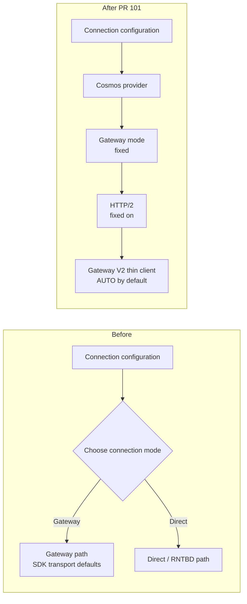
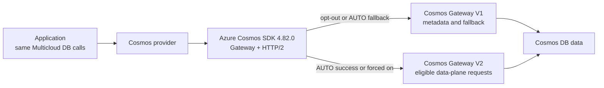
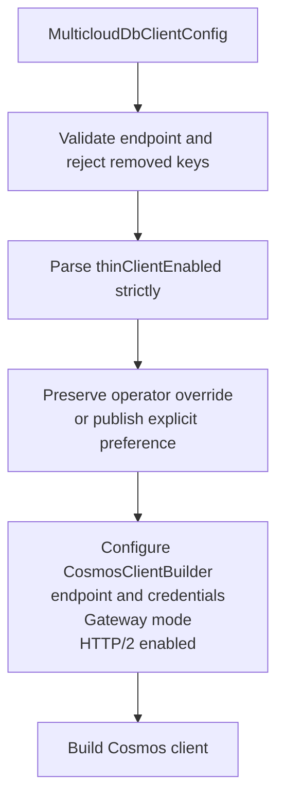
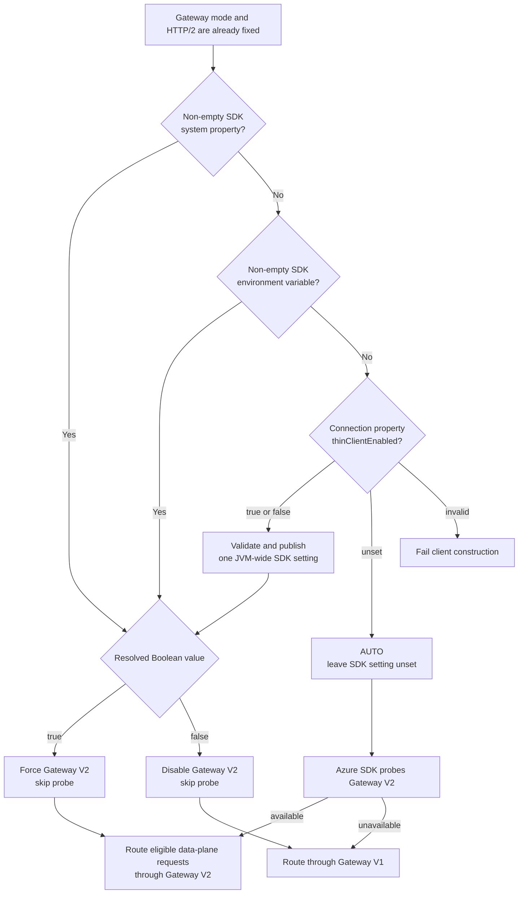

# Design: Cosmos Gateway Transport Defaults

**Status**: Implemented in PR #101
**Date**: 2026-08-31
**Feature spec**: [spec.md](spec.md)
**Implementation plan**: [plan.md](plan.md)

## Context

The Cosmos adapter previously exposed `connectionMode`, allowing Gateway or
Direct/RNTBD operation. Gateway HTTP/2 and Gateway V2 thin-client routing were
also easy to treat as one setting even though they are separate layers:

1. **Gateway mode** selects the HTTP-based Cosmos connectivity path instead of
   Direct/RNTBD.
2. **Gateway HTTP/2** selects the wire protocol used by the Gateway client.
3. **Gateway V2 thin-client proxy** selects a lower-overhead data-plane proxy
   when the account and network path support it.

The product decision is to standardize the first two and make the third safe by
default with an operational opt-out.

## Change at a Glance



`thinClientEnabled` now controls only the final Gateway V2 routing decision.
It cannot select Direct mode or disable HTTP/2.

## Goals

- Construct every Cosmos client in Gateway mode.
- Explicitly enable HTTP/2 for every Gateway client.
- Make SDK 4.82.0's probe-gated Gateway V2 behavior the zero-configuration
  default.
- Preserve deterministic hard opt-out and hard opt-in controls.
- Reject removed settings rather than silently changing their meaning.
- Keep the provider-neutral API and cross-provider data semantics unchanged.

## Non-goals

- Exposing Direct/RNTBD through the portable wrapper.
- Implementing a wrapper-owned Gateway V2 connectivity probe.
- Making the Azure SDK's global thin-client flag truly per-client.
- Exposing the narrower Azure query-plan kill switch.
- Defining Gateway connection-pool sizes; those are performance-tuning work in
  dependent PR #98.

## Decision Summary

| Area | Decision |
|---|---|
| Native SDK | Upgrade Azure Cosmos Java SDK to 4.82.0 |
| Connection mode | Always Gateway; no supported switch |
| HTTP protocol | Always HTTP/2 via explicit builder configuration |
| Gateway V2 default | Leave SDK thin-client value unset for probe/fallback |
| User override | `thinClientEnabled=false` disables; `true` forces |
| Operator precedence | SDK system property, then SDK environment variable |
| Removed keys | Reject `connectionMode` and `gatewayHttp2Enabled` |
| Portable API | No change |

## What "Thin Client" Means

The thin client is **not** another client library, application-side process,
sidecar, or proxy that users install. It is the Azure Cosmos SDK's name for
using the Gateway V2 thin-client proxy path for eligible data-plane requests.
Application code, credentials, endpoints, and Multicloud DB operations remain
the same.



Both branches remain Gateway-mode traffic. The setting changes which Gateway
implementation the Azure SDK uses; it does not change the portable API or
document/query behavior. Gateway V2 handles eligible data-plane requests;
metadata requests remain on Gateway V1 under the native SDK.

## Construction Flow



Validation precedes native client construction so malformed or stale
configuration cannot trigger credential work or network I/O.

## Gateway V2 Selection



| Effective preference | V2 probe | Eligible data-plane routing |
|---|---|---|
| unset / `AUTO` | yes | Gateway V2 when available; otherwise Gateway V1 |
| `false` | no | Gateway V1; Gateway V2 is disabled |
| `true` | no | Gateway V2 is forced; native connectivity failures remain visible |

> **Default does not mean `true`.** Leaving the value unset activates SDK
> 4.82.0's safe AUTO behavior. Explicit `true` bypasses the probe and fallback.

### Default

When `thinClientEnabled` is absent, the wrapper writes no SDK property. Azure
Cosmos SDK 4.82.0 uses a tri-state `null` value to represent this condition.
For Gateway HTTP/2 clients, the SDK probes thin-client connectivity and routes
through Gateway V2 only on an affirmative verdict. A failed or unavailable
probe leaves routing on Gateway V1.

This is intentionally different from setting `true`: explicit `true` is a hard
opt-in and bypasses the probe.

### Explicit override

The wrapper accepts only `true` or `false`, case-insensitive:

- `true` writes `COSMOS.THINCLIENT_ENABLED=true`;
- `false` writes `COSMOS.THINCLIENT_ENABLED=false`;
- any other value fails construction.

### Global-state boundary

The Azure SDK exposes thin-client selection through a system property or
environment variable, not `CosmosClientBuilder`. Therefore:

- a pre-existing non-empty SDK setting is never overwritten;
- the wrapper's check-and-set is synchronized;
- the first effective process setting remains authoritative;
- all Cosmos clients in one JVM must use a consistent preference.

This global behavior is documented as a provider constraint. Process isolation
is required if an application needs different Gateway V2 policies
simultaneously.

The system property and environment variable are native Azure SDK controls and
are expected to contain `true` or `false`. The wrapper strictly validates only
its `thinClientEnabled` connection property; native-setting parsing remains
owned by the SDK.

## Query-plan Routing

SDK 4.82.0 also has
`COSMOS.THINCLIENT_QUERY_PLAN_ENABLED`, a narrower kill switch. The query-plan
path first evaluates the main thin-client eligibility decision. Consequently,
the main `COSMOS.THINCLIENT_ENABLED=false` opt-out prevents both data-plane and
query-plan Gateway V2 routing. The wrapper does not duplicate the narrower
switch.

## Compatibility and Migration

This is a deliberate pre-release configuration and public-constant cleanup.

| Previous input | New result | Migration |
|---|---|---|
| no `connectionMode` | Fixed Gateway | none |
| `connectionMode=gateway` | construction failure | remove key |
| `connectionMode=direct` | construction failure | construct and use an Azure SDK client directly if Direct is essential |
| no HTTP/2 key | Fixed HTTP/2 | none |
| `gatewayHttp2Enabled=true/false` | construction failure | remove key |
| no thin-client key | auto-probe/fallback | recommended default |
| `thinClientEnabled=false` | hard opt-out | unchanged operational intent |

Failing even fixed-equivalent stale values ensures deployments do not retain
configuration that appears to control behavior but no longer does.

## Portability Analysis

The change is isolated to provider connection configuration. It does not alter
portable CRUD, query, paging, diagnostics, capability, or error contracts.
DynamoDB and Spanner have no corresponding provider setting to add.

The default favors portability operationally: applications still switch
providers through configuration only, while the Cosmos adapter owns its safe
native transport policy. Users needing Direct/RNTBD must construct and use the
Azure SDK directly and accept provider-specific code.

## Failure Handling

| Failure | Surface | Network I/O |
|---|---|---:|
| missing/blank endpoint | `IllegalArgumentException` | no |
| removed transport key | `IllegalArgumentException` with migration guidance | no |
| malformed thin-client value | `IllegalArgumentException` with valid values | no |
| Gateway V2 probe failure | automatic Gateway V1 fallback | probe only |
| explicit hard opt-in unsupported | native SDK connectivity failure | yes |

The wrapper does not catch or success-shape native failures from an explicit
hard opt-in.

## Testing Strategy

- Construction test captures `GatewayConnectionConfig`, asserts HTTP/2 is
  enabled, and verifies Direct mode is never called.
- Tri-state tests cover unset, `true`, and `false`.
- Precedence test verifies an operator SDK property is not overwritten.
- Validation tests cover malformed Boolean input and both removed keys.
- Existing builder mocks use the `gatewayMode(GatewayConnectionConfig)`
  overload.
- Cosmos emulator conformance confirms the fixed transport remains compatible
  with the emulator.

## Rollout and Rollback

Rollout is a normal provider-module release with Azure Cosmos SDK 4.82.0.
Release notes and configuration docs call out the removed keys and JVM-wide
override semantics.

Rollback requires reverting both the provider implementation and the Cosmos
SDK version. Operators can mitigate Gateway V2 independently by setting
`thinClientEnabled=false`; Gateway mode and HTTP/2 are intentional fixed
policy and have no runtime rollback switch.

## Dependency with Performance PRs

PR #101 is the base:

```text
#101 Cosmos Gateway defaults
  -> #98 performance harness and pool tuning
      -> #99 performance tests
```

PR #98 may retain pool-size and write-response controls, but it must not
reintroduce connection-mode or HTTP/2 enablement switches.
